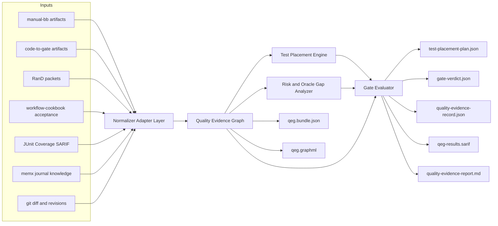
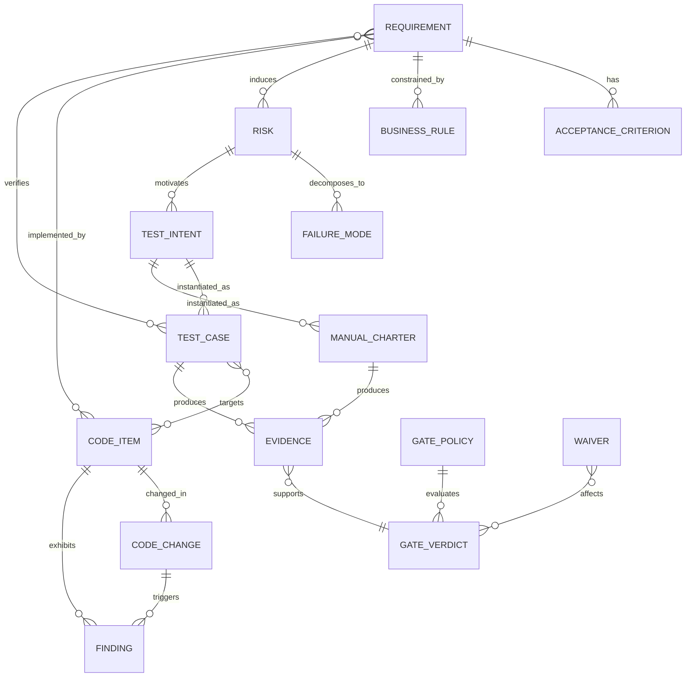
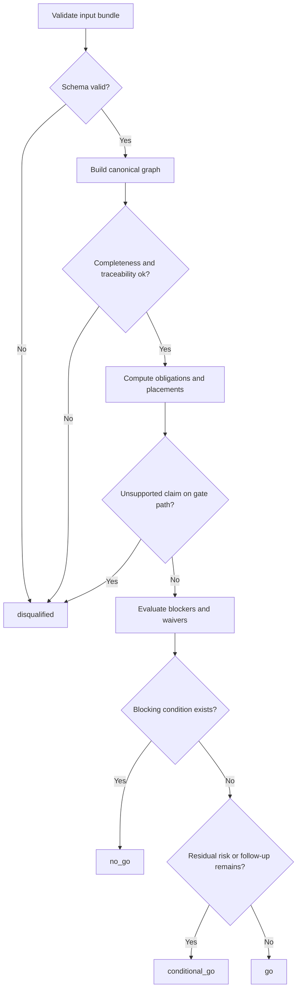
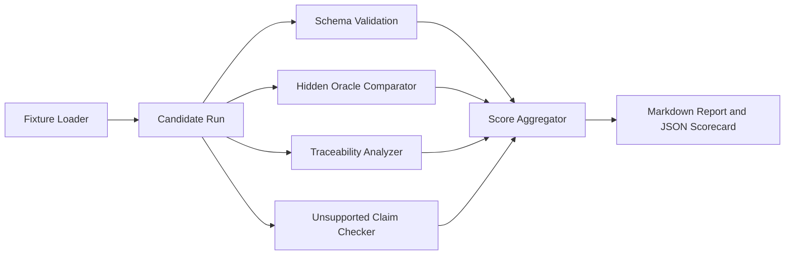

# Quality Evidence Graph 要求要件定義報告書

## エグゼクティブサマリ

本報告書は、`Quality Evidence Graph + Test Placement Engine`（別名 `risk-to-test-layer` / `quality-evidence-graph` / `test-layer-gate`）を、日本QA業界の「品質保証OS」の最後のピースとして実装するための要求・要件を定義するものである。既存OSS群はすでに、`manual-bb-test-harness` が `phase_contract` から `release_brief` までの手動ブラックボックスQAの監査可能チェーンを持ち、`code-to-gate` が `normalized-repo-graph`、`diff-analysis`、`findings`、`risk-register`、`test-seeds`、`release-readiness`、`audit` といったコード起点のゲート材料を持ち、`RanD` が `requirements_packet` と `requirements_audit_packet` を通じて要件の発見・監査を担い、`workflow-cookbook` が acceptance records と governance policy を持ち、`shipyard-cp` が `plan -> dev -> acceptance -> integrate -> publish` の制御面を持ち、`memx-core` が journal / knowledge / archive の記録基盤を持っている。欠けているのは、これらを一本の証跡グラフに接続し、仕様・実装差分・コードスメル・リスク・テスト・証跡・ゲート判定を同一ランタイムで扱う層だけである。 citeturn10view3turn11view0turn38view1turn38view2turn14view2turn14view1turn38view0turn13view2turn33view1turn10view1turn13view1turn13view0turn10view0turn33view0turn7view0turn7view1turn15view0turn15view4turn8view0turn8view2turn37view0

この最終ピースの役割は、単なる「AIによるテストケース生成」ではない。JSTQB / ISTQB は、テストレベルごとにテスト対象・目的・テストベースが異なること、リスクベースドテストが「リスク分析とリスクコントロール」に基づいてテスト活動を選択・優先順位付け・管理するものだと定義している。また、全数テストは不可能であり、優先順位付けとリスクベースドテストで労力を集中させるべきだとしている。したがって、本件の本質は「どのリスクを、どの証拠に基づき、どの層に置くテストで、どのコストで、どこまで falsify するか」を機械可読かつ再現可能に決めることである。 citeturn20view4turn19view4turn20view3turn19view2

外部環境では、品質保証への生成AI導入は進みつつあるが、まだ「実験」から「運用OS」への橋が足りない。日本総研の2025年レポートは、品質保証への生成AI活用がまだ手探り段階だとしつつ、今後はQAエンジニアの役割がテスト実行よりも品質に関する重要な意思決定や、ビジネス観点・ユーザ視点を含む多角的品質保証へ移ると述べている。World Quality Report 2025-26 でも、89% が QE で GenAI を試行または導入している一方、 enterprise-wide implementation に到達しているのは 15% に過ぎず、統合性・データプライバシー・信頼性が主要障壁として残っている。つまり、業界はもう「AIで書けるか」ではなく、「証跡付きで運用できるか」の段階にある。 citeturn23view0turn28view1turn28view0turn28view5turn28view6

本報告書の提案は明確である。最終ピースは、`requirement -> acceptance_criteria -> risk -> failure_mode -> changed_code -> code_smell/finding -> test_placement -> test_case/manual_charter -> execution_evidence -> gate_verdict` を一本のグラフとして保持し、`unit / integration / system / e2e / manual-scripted / manual-exploratory` に対して「最小コストで十分に反証できる層」を選び、最後に `Quality Evidence Record` を出力する。その際、`traceability`、`source_refs`、`assumptions`、`confidence`、`unsupported claim detection` を落とした出力は即座に失格させる。これは支援ツールではなく、業界の曖昧な品質保証実務を、証跡とゲートのある実行系へ置き換えるための基盤である。 `manual-bb-test-harness` が要求する出力順と `traceability/source_refs/assumptions/confidence` の保持、`code-to-gate` の evidence-backed artifacts、`workflow-cookbook` の acceptance/evidence/governance、`memx-core` の記録基盤を統合すれば、この設計は十分に現実的である。 citeturn16view1turn16view2turn13view3turn10view1turn33view0turn15view0turn15view2turn37view0

## 背景とスコープ

### 背景と目的

背景は単純である。コード生成と自動解析は加速しているのに、品質保証だけが「誰が何を根拠に Go/No-Go を言ったか」を十分に機械化できていない。`manual-bb-test-harness` は、仕様から直接ケースを量産するのではなく、`coverage model -> observation -> risk -> case -> gate -> brief` を段階的に接続するチェーンを採用し、`code-to-gate` は repository signals を evidence-backed risks と release-readiness へ変換し、`RanD` は requirement discovery を audit packet と gate verdict まで上げている。したがって最終ピースの目的は、新しい島を作ることではなく、既存の島をグラフの形で連結し、「品質保証はコードと証拠で再現できる」という状態へ移行させることである。 citeturn10view3turn16view1turn13view2turn10view1turn13view1turn10view0turn7view0turn7view1

### スコープ

| 種別 | 内容 |
|---|---|
| 含む | 仕様、受入条件、要件監査、実装差分、コードスメル、リスク、テストコード、手動観点、実行証跡、acceptance records を統合したグラフ構築 |
| 含む | `unit / integration / system / e2e / manual-scripted / manual-exploratory` の配置決定 |
| 含む | Gate判定、失格条件判定、再現可能な `Quality Evidence Record` 生成 |
| 含む | JSON / GraphML / SARIF / Markdown のエクスポート、CLI / API / CI 統合 |
| 含む | `skill-to-gate` ベンチ、fixture、比較実験、レポート |
| 未指定 | 対象言語の最終範囲。初期の first-class 対応は `code-to-gate` の schema が明示する `ts/tsx/js/jsx/py/rb/go/rs/java/php/cs/cpp` を優先するが、全言語対応は未指定。 citeturn13view2 |
| 未指定 | CI環境の最終範囲。GitHub Actions を first-class に置くが、GitLab / Jenkins / Azure DevOps の網羅的サポートは未指定。GitHub での SARIF upload と code scanning 連携は first-class 対象とする。 citeturn34view0turn34view1 |
| 未指定 | 組織規模、規制業種、テスト管理SaaSの最終サポート範囲。TestRail / Xray / Notion は既存OSSが連携補助を持つが、その他は未指定。 citeturn10view3turn11view0 |
| 含まない | 実機クラウド、MDM、実行基盤そのものの構築 |
| 含まない | Playwright や Jest など自動テストフレームワーク本体の実装 |
| 含まない | 外部SaaS本番運用設定、組織固有の正本業務ルールの新規策定 |

このスコープ整理は、`manual-bb-test-harness` が自ら mobile 実行基盤構築や外部 SaaS 本番運用設定を Out-of-Scope とし、artifact contract と export/import 補助に集中していること、および `workflow-cookbook` が acceptance records と policy/gates を持つ一方で個々の開発実装を代替しないことに沿っている。 citeturn10view3turn15view0turn15view4

### 未指定事項

未指定事項は、意図的に extension point として残す。実装時に勝手に固定してはいけない。

- 対象プログラミング言語の最終サポート順序
- モノレポ前提か、単一リポジトリ前提か
- テスト実行環境の最終正本
- 組織の承認フロー段数
- リリース単位が PR / sprint / train / formal release のどれか
- 監査保持期間
- API 認証方式
- LLM 利用の有無、利用時の provider 制約
- 海外拠点を含むデータ越境要件
- 規制対象ドメインごとの追加監査要求

## 既存OSSマッピング

既存OSSは「競合」ではなく、最終ピースの upstream/downstream 契約面である。下表は、どのリポジトリが何を持ち、最終ピースでどう使うかを整理したものである。

| OSS | 確認できる契約・artefact・機能 | 現在の役割 | Quality Evidence Graph / Test Placement Engine での役割 | 優先度 |
|---|---|---|---|---|
| manual-bb-test-harness | `phase_contract`, `feature_spec`, `test_model`, `observation_set`, `risk_register`, `manual_case_set`, `effort_plan`, `gate_decision`, `release_brief`, `execution_evidence`。`feature_spec` は `acceptance_criteria`, `business_rules`, `changed_areas`, `source_refs`, `assumptions` を持ち、`manual_case_set` は scripted cases / exploratory charters / `platform_matrix` / `role_matrix` を持つ。`gate_decision` は `go / conditional_go / no_go` を持つ。 citeturn10view3turn11view0turn38view1turn14view2turn14view0turn14view1turn38view0turn38view2 | 仕様起点の black-box gate | requirement / acceptance / manual obligations / oracle gaps / release decision の正本。特に manual 層の配置と仕様曖昧性の検出で中心になる。 | P0 |
| code-to-gate | `normalized-repo-graph`, `diff-analysis`, `findings`, `invariants`, `risk-register`, `test-seeds`, `release-readiness`, `audit`。`test-seeds` は `sourceRiskIds`, `sourceFindingIds`, `evidence`, `suggestedLevel` を持ち、`release-readiness` は `passed / passed_with_risk / needs_review / blocked_input / failed` を持つ。`audit` は input hashes, policy hash, LLM request/response hash を持つ。 citeturn13view2turn33view1turn10view1turn33view2turn13view1turn13view0turn10view0turn33view0 | 実装起点の second gate | changed code / blast radius / smells / evidence-backed findings から自動テスト層の初期候補を生成し、最終ゲートの技術面を支える。 | P0 |
| RanD | `requirements_packet` は `requirements`, `kpi`, `acceptance`, `risk`, `confidence`, `downstream_hooks`, `gate_policy` を持ち、`requirements_audit_packet` は `testability`, `implementation_alignment`, `issues`, `suggested_action`, `gate.verdict` を持つ。 `kano.json` は `evidence_cluster`, `confidence`, `bias_note`, `kill_condition` を持つ。 citeturn7view0turn7view1turn7view2turn7view3turn7view4turn7view5 | 要件発見と upstream 監査 | requirements の正規化・監査・ readiness 判定を QEG の requirement layer に流し込む。 | P0 |
| workflow-cookbook | acceptance record は `acceptance_id`, `task_id`, `intent_id`, `owner`, `status`, `reviewed_at`, `reviewed_by` と本文 `Scope`, `Acceptance Criteria`, `Evidence`, `Verification Result` を要求する。 governance policy は `self_modification.forbidden_paths`, `require_human_approval`, `ci.required_jobs`, checker stages, SLO を持つ。 citeturn15view0turn15view2turn15view4 | evidence tracking / governance / acceptance index | acceptance evidence、policy、required jobs、waiver と gate governance の接続点。 | P0 |
| shipyard-cp | 状態管理ディレクトリ、`task`, `run`, `timeline`, `audit`、`plan / dev / acceptance / integrate / publish` stage model、inbox/outbox/autopilot を持つ。 citeturn8view0turn8view1turn8view2 | control plane / orchestration | QEG/TPE を CI・multi-stage workflow に組み込む制御面。 | P1 |
| memx-core | `short`, `journal`, `knowledge`, `archive` の4ストア、API endpoints、要約、secret 保存拒否、既定 sensitivity=`internal` を持つ。 citeturn37view0 | run memory / decision log | `Quality Evidence Record` の run history、waiver history、human decision log の保存先。 | P1 |
| portfolio | 決定的な spec-to-cases / blueprint-to-playwright / flaky analyzer / LLM adapter、Pass Rate 100%、coverage 90%+、Evidence Library を持つ。 citeturn9view1turn9view4 | reference implementation / evidence corpus | ベンチマーク用の再現可能サンプル、品質基準の reference corpus。 | P2 |

このマッピングの含意は非常に強い。最終ピースは新しい「万能AIテスター」ではなく、既存OSSがすでに持っている artifact contract を、 graph 上で join し、 gate と test placement を計算する orchestrating core であるべきだ。 upstream の schema を壊さず、 downstream の acceptance / code scanning / audit へ流せることが最優先である。 `manual-bb-test-harness` の Required Output Chain と `code-to-gate` の evidence-backed artifacts が、その方向性をはっきり示している。 citeturn16view1turn16view2turn10view1turn10view0

## 要求一覧

以下の要求は、「既存OSSの契約を壊さず、最後の 1 ピースとして成立すること」を前提にした要求一覧である。ここでは実装上の必須条件を、機能要求・非機能要求・運用要求・セキュリティ/プライバシー・法規制対応に分けて示す。

| ID | 区分 | 要求 | 受入条件の要点 |
|---|---|---|---|
| F-01 | 機能 | `manual-bb-test-harness`, `code-to-gate`, `RanD`, `workflow-cookbook`, JUnit/Coverage/SARIF, git diff を ingest できること | 既存 artifact を変換なしで取り込み、 canonical schema に正規化できる |
| F-02 | 機能 | requirement / acceptance / risk / failure_mode / code / finding / test / evidence / gate を単一 graph へ統合すること | stable ID で join され、 from-to の traceability が逆引き可能 |
| F-03 | 機能 | changed code と blast radius を requirement/risk/test に接続すること | diff hunk 単位で関連 symbol/test/entrypoint が引ける |
| F-04 | 機能 | risk ごとに `unit / integration / system / e2e / manual-scripted / manual-exploratory` の配置候補を算出すること | 各候補に rationale, cost, confidence, gate relevance が付く |
| F-05 | 機能 | 既存テスト資産の再利用と不足テストの新規要求を区別すること | “reuse / adapt / add / manual-only / blocked” の判定が出る |
| F-06 | 機能 | oracle gap を検出し、曖昧仕様を「分かったことにしない」こと | high/critical な oracle gap は gate を `conditional_go` 以上へ上げない |
| F-07 | 機能 | `Quality Evidence Record` を JSON と Markdown で出力すること | run 再現に必要な input refs / policy hash / evidence hash を保持 |
| F-08 | 機能 | GraphML エクスポートを提供すること | 外部可視化ツールでノード/エッジ属性が保持される |
| F-09 | 機能 | SARIF 2.1.0 互換の findings export を提供すること | GitHub Code Scanning に upload 可能 |
| F-10 | 機能 | Gate verdict と disqualified 判定を出すこと | `go / conditional_go / no_go / disqualified` の4値が返る |
| F-11 | 機能 | acceptance record と gate 判定を結び付けること | gate の根拠に acceptance record のリンクが埋まる |
| F-12 | 機能 | `skill-to-gate` benchmark mode を持つこと | hidden oracle 付き fixture 群で placement/gate 精度を測れる |
| N-01 | 非機能 | local-first を既定とすること | source code を外部へ送らなくても動作する |
| N-02 | 非機能 | 決定性を持つこと | 同一 input / policy / revision では同一 ID と同一 gate を返す |
| N-03 | 非機能 | incremental mode を持つこと | PR diff 実行時は full rebuild より高速である |
| N-04 | 非機能 | explainability を持つこと | すべての placement/gate reason に source_refs と traceability がある |
| N-05 | 非機能 | own-output validation を強制すること | 出力 artifact は schema validation を常に通る |
| N-06 | 非機能 | extensibility を持つこと | 新規 adapter / new layer / new evidence type を policy と schema で拡張できる |
| O-01 | 運用 | waiver を期限付きで管理できること | waiver reason, approver, expiry, linked risk が必須 |
| O-02 | 運用 | safe fallback を持つこと | graph completeness が崩れた場合は全テスト実行または no_go に倒れる |
| O-03 | 運用 | governance policy を versioned artifact として扱うこと | policy hash と policy id が監査記録に残る |
| O-04 | 運用 | acceptance / release / PR の各局面で gate profile を切替可能にすること | `strict / standard / lean` または同等 profile が動く |
| O-05 | 運用 | human review point を明示すること | spec gap, privacy issue, manual-only decision には reviewer 必須 |
| S-01 | セキュリティ | secret / token / credential を evidence へ残さないこと | redaction か保存拒否のどちらかになる |
| S-02 | セキュリティ | evidence excerpt は hash で固定し、改ざん検知可能にすること | path/line/hash 三点セットを保持 |
| S-03 | セキュリティ | LLM を使う場合は prompt/request/response hash を監査すること | 監査 artifact に provider/model/hash が残る |
| S-04 | セキュリティ | API 利用時は repo path allowlist と local bind を既定にすること | 不要な外部公開をしない |
| S-05 | セキュリティ | benchmark contamination を防ぐこと | hidden oracle に candidate がアクセスできない |
| L-01 | 法規制 | APPI 該当データを分類し、目的外保持を避けること | PII / individual identifiers / business secrets の扱いが policy 化される |
| L-02 | 法規制 | GDPR 対象時は purpose limitation / data minimisation / storage limitation / accountability に従えること | 収集目的、最小化、保持期間、説明責任が artifact 上で確認できる |
| L-03 | 法規制 | 日本の AI 事業者ガイドラインへ接続できること | checklist / worksheet へのマッピング項目を持つ |
| L-04 | 法規制 | evidence export の越境・保持・削除方針を設定可能にすること | org policy と run policy の両方で制御できる |

これらの要求のうち、特に `local-first`、`own-output validation`、`evidence-backed export`、`SARIF 2.1.0`、`policy hash`, `traceability/source_refs/assumptions/confidence` は既存OSSや公式仕様に強く基づく。 `code-to-gate` は repository evidence 중심の運用と SARIF export/GitHub upload をすでに持ち、`manual-bb-test-harness` は own-output validation と traceability discipline を要求し、GitHub Code Scanning は SARIF 2.1.0 subset を受け入れる。 provenance 表現には W3C PROV-DM / PROV-JSON の考え方がそのまま使える。 citeturn16view3turn16view1turn44view3turn34view0turn34view1turn34view3turn35view0

## 詳細要件とデータモデル

### 全体アーキテクチャ

既存OSSを崩さずに最終ピースを成立させるには、`adapter -> normalizer -> graph -> placement -> gate -> record/export` の層分離が必要である。 `code-to-gate` 側には diff, repo graph, finding, test seed, readiness, audit があり、`manual-bb-test-harness` 側には feature, risk, manual cases, gate, execution evidence があり、`RanD` と `workflow-cookbook` が requirement audit と acceptance evidence を補う。これらを canonical graph に正規化したうえで placement と gate を計算するのが最も自然である。 citeturn13view2turn33view1turn10view1turn13view0turn10view0turn38view1turn14view2turn14view1turn38view0turn7view0turn15view0



### 入力スキーマ

最終ピースの canonical intake は、既存 artifacts を包む `intake-bundle.json` とする。既存ファイルそのものを改造せず、 `kind`, `path`, `hash`, `schema`, `revision`, `adapter` をつけて bundle 化する。

| 入力ソース | 最小入力単位 | canonical 必須抽出項目 | 用途 |
|---|---|---|---|
| manual-bb-test-harness | `phase_contract.json` | readiness, open_questions, spec_gaps, technical_risks, test_lenses, source_refs | readiness / spec gap / upstream block |
| manual-bb-test-harness | `feature_spec.json` | feature_id, title, acceptance_criteria, business_rules, changed_areas, devices, source_refs, assumptions | requirement / acceptance / environment |
| manual-bb-test-harness | `risk_register.json` | risk id, scenario, impact, likelihood, priority, rationale, trace_to | black-box risk |
| manual-bb-test-harness | `manual_case_set.json` | tc_id, priority, primary_view, oracle, source_ref, trace_to, exploratory charter | manual placement / oracle quality |
| manual-bb-test-harness | `gate_decision.json`, `execution_evidence.json` | status, reasons, residual_risks, expected, actual, result, attachments | prior gate / execution evidence |
| code-to-gate | `normalized-repo-graph.json` | files, symbols, relations, entrypoints, diagnostics | code graph |
| code-to-gate | `diff-analysis.json` | changed_files, hunks, blast_radius, diff_findings | PR mode / blast radius |
| code-to-gate | `findings.json`, `invariants.json`, `risk-register.json` | finding severity/confidence/evidence, invariants, risk narratives | technical findings / risk |
| code-to-gate | `test-seeds.json`, `release-readiness.json`, `audit.json` | suggestedLevel, failedConditions, artifactRefs, input hashes, policy hash | auto seeds / technical gate / provenance |
| RanD | `requirements_packet.json`, `requirements_audit_packet.json`, `kano.json` | requirements, KPI, acceptance, issues, gate verdict, evidence cluster, kill_condition | upstream requirement normalization |
| workflow-cookbook | acceptance markdown / generated index | acceptance_id, task_id, intent_id, status, Acceptance Criteria, Evidence, Verification Result | acceptance proof |
| External execution | JUnit, coverage, SARIF | test id, result, coverage target, rule id, location, severity | already-run evidence |

この入力設計は、既存 schema の中心フィールドをそのまま活かす方針である。 `manual-bb-test-harness` の `feature_spec` と `phase_contract` は requirement/ambiguity/oracle gap の正規化元として十分であり、`code-to-gate` の `diff-analysis` と `normalized-repo-graph` は changed code と blast radius を接続するのに十分である。 `workflow-cookbook` の acceptance record は human acceptance proof の正本として機能する。 citeturn38view2turn38view1turn14view2turn14view1turn38view0turn13view2turn33view1turn10view1turn13view0turn10view0turn7view0turn7view1turn15view0

入力 bundle の例は次のとおりである。

```jsonc
{
  "version": "qeg/v1",
  "run_id": "run-2026-06-02-001",
  "repo": {
    "root": "./",
    "base_ref": "origin/main",
    "head_ref": "HEAD"
  },
  "inputs": [
    {
      "kind": "manual-bb/feature_spec",
      "path": "artifacts/feature_spec.json",
      "schema": "feature_spec@manual-bb",
      "hash": "sha256:...",
      "adapter": "manual-bb"
    },
    {
      "kind": "code-to-gate/diff-analysis",
      "path": ".qh/diff-analysis.json",
      "schema": "diff-analysis@ctg",
      "hash": "sha256:...",
      "adapter": "code-to-gate"
    },
    {
      "kind": "workflow/acceptance-record",
      "path": "docs/acceptance/AC-20260602-01.md",
      "schema": "acceptance-record@wc",
      "hash": "sha256:...",
      "adapter": "workflow-cookbook"
    }
  ]
}
```

### 出力スキーマと中間 artifact

最終ピースの出力は 1 つでは足りない。機械用・監査用・可視化用を分ける必要がある。

| Artifact | 目的 | 必須項目 |
|---|---|---|
| `qeg.bundle.json` | canonical graph 本体 | version, generated_at, run_id, repo, nodes, edges, completeness, provenance |
| `test-placement-plan.json` | 各 risk/requirement の配置決定 | placement_id, target layer, rationale, confidence, priority, cost, traceability |
| `gate-verdict.json` | Gate判定専用 | status, disqualified, failed_conditions, waivers, residual_risks |
| `quality-evidence-record.json` | 最終監査記録 | inputs, policy, placements, evidence index, gate summary, provenance |
| `qeg.graphml` | 外部 graph 可視化 | nodes, edges, typed attributes |
| `qeg-results.sarif` | code scanning / PR annotation | rules, results, locations, fingerprints |
| `quality-evidence-report.md` | 人間が読むサマリ | scope, highest risks, placement summary, gate summary, next actions |

`quality-evidence-record.json` は、`code-to-gate` の `audit` と `release-readiness`、`manual-bb-test-harness` の `gate_decision` と `execution_evidence` を統合した監査 artifact と定義する。ここでは `input hashes`, `policy hash`, `prompt hash`、`placement rationale`、`gate failed conditions` が一本化されなければならない。 citeturn33view0turn10view0turn14view1turn38view0

`quality-evidence-record.json` の例を示す。

```jsonc
{
  "version": "qeg/v1",
  "generated_at": "2026-06-02T10:30:00+09:00",
  "run_id": "run-2026-06-02-001",
  "repo": {
    "root": "./",
    "base_ref": "origin/main",
    "head_ref": "HEAD"
  },
  "policy": {
    "id": "quality-gate/default",
    "hash": "sha256:..."
  },
  "scope": {
    "feature_ids": ["ORD-CANCEL-01"],
    "changed_files": ["src/order/cancel.ts"]
  },
  "placements": [
    {
      "placement_id": "plc-001",
      "test_id": "test:unit:order-cancel-pending",
      "layer": "unit",
      "target_code": ["sym:src/order/cancel.ts#cancelOrder"],
      "changed_code": ["chg:src/order/cancel.ts#L12-L43"],
      "requirement": ["req:ORD-CANCEL-01"],
      "acceptance_criteria": ["ac:AC-1"],
      "risk": ["risk:RISK-01"],
      "failure_mode": ["fm:pending-only-regression"],
      "business_impact": "キャンセル不能によりCS問い合わせ増加",
      "evidence": ["finding:F-001", "diff:D-001"],
      "confidence": 0.93,
      "priority": 95,
      "gate_relevance": "blocking",
      "traceability": [
        "req:ORD-CANCEL-01->risk:RISK-01",
        "risk:RISK-01->chg:src/order/cancel.ts#L12-L43",
        "chg:src/order/cancel.ts#L12-L43->test:unit:order-cancel-pending"
      ],
      "source_refs": ["SPEC-12", "AC-1", "ctg:finding/F-001"],
      "assumptions": []
    }
  ],
  "gate": {
    "status": "conditional_go",
    "disqualified": false,
    "failed_conditions": ["manual-evidence-missing-for-offline-mobile-path"],
    "residual_risks": ["risk:RISK-04"],
    "required_follow_up": ["add mobile background-resume charter before release"]
  }
}
```

### API、CLI、CI 統合

インターフェースは CLI first、API second が妥当である。既存OSSが Python/Node 混在であっても、artifact contract は JSON / Markdown / SARIF なので、呼び出し境界を CLI と schema に寄せた方が統合が容易である。 `code-to-gate` は CLI から `scan / analyze / diff / readiness / export sarif` を持ち、GitHub Actions では `github/codeql-action/upload-sarif@v4` を使っている。 `memx-core` は local API endpoints を持つ。最終ピースもこれに倣うべきである。 citeturn44view0turn44view3turn34view1turn37view0

推奨 CLI は次の 6 本に絞る。

```bash
# 取り込み
qeg ingest --bundle intake-bundle.json --out .qeg

# グラフ構築
qeg build-graph --from .qeg --out .qeg

# テスト配置
qeg place-tests --from .qeg --policy quality-policy.yaml --out .qeg

# Gate判定
qeg gate --from .qeg --policy quality-policy.yaml --out .qeg --fail-on no_go,disqualified

# 出力
qeg export graphml --from .qeg --out .qeg/qeg.graphml
qeg export sarif --from .qeg --out .qeg/qeg-results.sarif

# ベンチ
qeg bench run --suite fixtures/skill-to-gate --candidate .qeg --out reports/
```

推奨 API は次の通りである。

```jsonc
POST /v1/intake:bundle
{
  // 既存artifactの束を登録する
  "bundle_path": "intake-bundle.json"
}

POST /v1/graph:build
{
  // run_id単位で正規化グラフを作る
  "run_id": "run-2026-06-02-001"
}

POST /v1/placement:compute
{
  // 指定policyで配置決定する
  "run_id": "run-2026-06-02-001",
  "policy_id": "quality-gate/default"
}

POST /v1/gate:evaluate
{
  // Gateと失格条件を評価する
  "run_id": "run-2026-06-02-001",
  "fail_on": ["no_go", "disqualified"]
}

GET /v1/runs/{run_id}/record
```

GitHub Actions の最小統合例は、既存の `code-to-gate` フローと GitHub の SARIF upload 方法に合わせて、次のような形にする。

```yaml
name: quality-evidence-gate

on:
  pull_request:

jobs:
  qeg:
    runs-on: ubuntu-latest
    steps:
      - uses: actions/checkout@v4

      - name: Run code-to-gate
        run: node ./dist/cli.js analyze . --emit all --out .qh

      - name: Build Quality Evidence Graph
        run: qeg ingest --bundle intake-bundle.json --out .qeg && qeg build-graph --from .qeg --out .qeg

      - name: Compute placements and gate
        run: qeg place-tests --from .qeg --policy .github/quality-policy.yaml --out .qeg && qeg gate --from .qeg --policy .github/quality-policy.yaml --fail-on no_go,disqualified --out .qeg

      - name: Upload SARIF
        uses: github/codeql-action/upload-sarif@v4
        with:
          sarif_file: .qeg/qeg-results.sarif
```

### Quality Evidence Graph のデータモデル

Quality Evidence Graph は、概念的には W3C PROV-DM の `entity / activity / agent / derivation / bundle` を下敷きにしつつ、実装は domain-specific な typed property graph とするのが最善である。 PROV-DM は provenance を、データや物の品質・信頼性を評価するための entities, activities, agents の記録として定義し、PROV-JSON はそれを indexed JSON object として高速 lookup 向きに表現する。これにより、最終ピースは「graph query を速くする内部表現」と「監査向け provenance projection」の両方を持てる。 GraphML は XML ベースの graph exchange 形式で、typed attributes を持つ graph を外部ツールへ渡すのに向く。 citeturn34view3turn35view0turn36view0

#### ノード定義

| Node type | 説明 | 必須フィールド |
|---|---|---|
| `requirement` | 要件本体 | id, requirement, source_refs, confidence |
| `acceptance_criterion` | 受入条件 | id, acceptance_criteria, source_refs |
| `business_rule` | 業務ルール | id, text, source_refs |
| `risk` | black-box または technical risk | id, risk, business_impact, priority, confidence |
| `failure_mode` | 失敗様式 | id, failure_mode, linked_risk |
| `code_item` | file / symbol / entrypoint | id, target_code, source_path |
| `code_change` | diff hunk | id, changed_code, revision, blast_radius |
| `finding` | static finding / smell / invariant violation | id, evidence, confidence, severity |
| `test_intent` | まだ実体化前のテスト義務 | id, test_id, layer_candidates, priority, gate_relevance |
| `test_case` | unit/integration/system/e2e/manual-scripted | id, test_id, target_code, requirement, risk, acceptance_criteria, confidence |
| `manual_charter` | exploratory charter | id, test_id, scope, questions, assumptions |
| `evidence` | test result / log / screenshot / acceptance record / SARIF result | id, evidence, confidence, source_refs |
| `gate_policy` | gate rule set | id, policy_hash |
| `gate_verdict` | run 単位の gate 結果 | id, status, failed_conditions, gate_relevance |
| `waiver` | 期限付き例外 | id, approver, expires_at, rationale |

#### エッジ定義

| Edge type | 意味 |
|---|---|
| `derived_from` | 派生関係 |
| `implemented_by` | requirement -> code_item |
| `changed_in` | code_item -> code_change |
| `exhibits` | code_item/change -> finding |
| `induces` | requirement/business_rule -> risk |
| `decomposes_to` | risk -> failure_mode |
| `motivates` | risk/failure_mode -> test_intent |
| `instantiated_as` | test_intent -> test_case/manual_charter |
| `verifies` | test_case -> requirement/acceptance_criterion |
| `targets` | test_case -> target_code |
| `produces` | test_case -> evidence |
| `supports` | evidence -> gate_verdict |
| `blocked_by` | requirement/risk/test -> open_question/spec_gap/finding |
| `waived_by` | risk/gate condition -> waiver |

#### 必須メタデータ

ユーザ指定の必須メタデータは、 graph の内部正規化では分散していてよいが、`test_intent`, `test_case`, `evidence`, `gate_verdict` に対する denormalized view として必ず再構成できなければならない。必須項目は以下とする。

- `test_id`
- `target_code`
- `changed_code`
- `requirement`
- `acceptance_criteria`
- `risk`
- `failure_mode`
- `business_impact`
- `evidence`
- `confidence`
- `priority`
- `gate_relevance`
- `traceability`
- `source_refs`
- `assumptions`

これを ER 図で表すと次のようになる。



QEG JSON の最小例を示す。

```jsonc
{
  "version": "qeg/v1",
  "graph_id": "qeg-20260602-001",
  "nodes": [
    {
      "id": "req:ORD-CANCEL-01",
      "type": "requirement",
      "requirement": "購入者はpending注文をキャンセルできる",
      "source_refs": ["SPEC-12", "AC-1"],
      "assumptions": [],
      "confidence": 0.98
    },
    {
      "id": "risk:RISK-01",
      "type": "risk",
      "risk": "pending以外でも取消可能になる回帰",
      "business_impact": "返金誤処理・CS問い合わせ増加",
      "priority": 95,
      "confidence": 0.91,
      "source_refs": ["req:ORD-CANCEL-01", "ctg:finding/F-001"],
      "assumptions": []
    },
    {
      "id": "chg:src/order/cancel.ts#L12-L43",
      "type": "code_change",
      "changed_code": ["src/order/cancel.ts#L12-L43"],
      "source_refs": ["git:HEAD"],
      "confidence": 1.0
    },
    {
      "id": "test:unit:order-cancel-pending",
      "type": "test_case",
      "test_id": "test:unit:order-cancel-pending",
      "target_code": ["sym:src/order/cancel.ts#cancelOrder"],
      "requirement": ["req:ORD-CANCEL-01"],
      "acceptance_criteria": ["ac:AC-1"],
      "risk": ["risk:RISK-01"],
      "failure_mode": ["fm:pending-only-regression"],
      "priority": 95,
      "gate_relevance": "blocking",
      "traceability": [
        "req:ORD-CANCEL-01->risk:RISK-01",
        "risk:RISK-01->chg:src/order/cancel.ts#L12-L43"
      ],
      "source_refs": ["SPEC-12", "AC-1", "ctg:finding/F-001"],
      "assumptions": [],
      "confidence": 0.93
    }
  ],
  "edges": [
    { "id": "e1", "type": "induces", "from": "req:ORD-CANCEL-01", "to": "risk:RISK-01" },
    { "id": "e2", "type": "changed_in", "from": "test:unit:order-cancel-pending", "to": "chg:src/order/cancel.ts#L12-L43" }
  ]
}
```

GraphML の最小例は以下とする。

```xml
<?xml version="1.0" encoding="UTF-8"?>
<graphml xmlns="http://graphml.graphdrawing.org/xmlns">
  <key id="type" for="node" attr.name="type" attr.type="string"/>
  <key id="priority" for="node" attr.name="priority" attr.type="int"/>
  <key id="confidence" for="node" attr.name="confidence" attr.type="double"/>
  <key id="edgeType" for="edge" attr.name="edgeType" attr.type="string"/>

  <graph id="qeg-20260602-001" edgedefault="directed">
    <node id="req:ORD-CANCEL-01">
      <data key="type">requirement</data>
      <data key="confidence">0.98</data>
    </node>
    <node id="risk:RISK-01">
      <data key="type">risk</data>
      <data key="priority">95</data>
      <data key="confidence">0.91</data>
    </node>
    <node id="test:unit:order-cancel-pending">
      <data key="type">test_case</data>
      <data key="priority">95</data>
      <data key="confidence">0.93</data>
    </node>
    <edge id="e1" source="req:ORD-CANCEL-01" target="risk:RISK-01">
      <data key="edgeType">induces</data>
    </edge>
    <edge id="e2" source="risk:RISK-01" target="test:unit:order-cancel-pending">
      <data key="edgeType">motivates</data>
    </edge>
  </graph>
</graphml>
```

## 決定ロジックと評価ベンチ

### Test Placement Engine の決定ロジック

Test Placement Engine は、「もっとも高価で派手なテスト層」を選ぶエンジンではなく、「もっとも安く、もっとも早く、しかし十分な fidelity でリスクを反証できる層」を選ぶエンジンである。これは ISTQB/JSTQB の test levels と risk-based testing の考え方に整合する。さらに changed-code ベースで relevant tests を選ぶ考え方は、Azure DevOps の Test Impact Analysis でも実運用されており、理解不能な変更では full run へ safe fallback する。この “fast path + safe fallback” は本設計でも必須である。 citeturn20view4turn20view3turn34view5

#### 判定原則

1. **Eligibility rule first**  
   各リスクを、まず層ごとの適格条件に通す。適格でない層はスコア計算前に落とす。
2. **Cheapest sufficient falsification**  
   適格層のうち、十分な反証力を持ちながら最小コストの層を primary に選ぶ。
3. **Sentinel layering**  
   `business_impact` が高い、`gate_relevance=blocking`、あるいは interaction depth が深い場合は、lower layer だけで終えず higher layer に sentinel test を追加する。
4. **No oracle, no certainty**  
   oracle が弱い場合は、automation より先に `manual-exploratory` または spec clarification を置く。
5. **Human-first on ambiguity, UX, perception, mobile lifecycle**  
   曖昧仕様、主観評価、OS lifecycle、ネットワーク変動、外部サービス契約の不安定性は manual 層へ逃がす。

#### 層ごとのルール

| 層 | 強く選ぶ条件 | 原則として避ける条件 | 主な証拠 |
|---|---|---|---|
| unit | pure logic、単一関数、強い oracle、外部境界なし、changed_code が局所 | 外部I/O、契約差分、ユーザフロー、主観評価 | symbol, diff hunk, invariant, deterministic AC |
| integration | DB/API/event/message/serializer/permission matrix など interface/contract 差分 | UX全体、複数外部境界、複雑な end-user flow | relation graph, entrypoint, diff, finding |
| system | サブシステム連携、config/feature flag/role、複数 component orchestration | 完全な本番経路の最終承認 | blast radius, business flow, non-functional concern |
| e2e | ユーザ旅程、UI + backend + auth + external service を跨ぐ flow、deploy readiness | 純粋ロジックの局所検証 | acceptance criteria, system readiness, user action path |
| manual-scripted | observable な expected result があるが自動化コストが高い、device/third-party/ops 手順 | oracle 不明、探索が必要な未知領域 | manual case, oracle refs, environment matrix |
| manual-exploratory | 曖昧仕様、oracle 不足、UX/perception、mobile lifecycle、novel failure mode | 既知の deterministic rule だけの検証 | charter, question set, prior anomalies |

#### 優先度アルゴリズム

最終ピースは 2 段階で決める。まず obligation を作る。 obligation は「特定の requirement / risk / failure_mode / changed_code の組」に対して、1 本以上のテスト義務を表す。

**Risk Priority Index**

```text
RPI =
  100 * (
    0.25 * severity +
    0.15 * likelihood +
    0.20 * business_impact +
    0.15 * blast_radius +
    0.10 * compliance_criticality +
    0.10 * evidence_gap +
    0.05 * novelty
  )
```

各要素は 0.0〜1.0 に正規化する。 `severity` と `likelihood` は既存 risk registers を優先し、なければ `findings` から補完する。

**Layer Fit Score**

```text
fit(layer) =
  0.30 * oracle_fit(layer) +
  0.20 * change_proximity(layer) +
  0.15 * interaction_fit(layer) +
  0.15 * business_fidelity(layer) +
  0.10 * observability(layer) +
  0.05 * stability(layer) +
  0.05 * reuse_gain(layer)

cost_penalty(layer) =
  0.40 * setup_cost +
  0.30 * runtime_cost +
  0.30 * flake_risk

final_score(layer) =
  RPI * (fit(layer) - 0.35 * cost_penalty(layer))
```

**選択手順**

- `eligible(layer)=false` は即除外。
- 最大 `final_score` の層を baseline にする。
- baseline から 7 点以内で、かつコストが低い lower layer があればそれを primary にする。
- `gate_relevance=blocking` かつ `business_impact >= 0.8` の場合、primary とは別に higher layer sentinel を 1 本追加する。
- `oracle_fit < 0.5` の場合、自動層は参考扱いに落とし、`manual-exploratory` または `spec_clarification` obligation を追加する。
- changed code が UI/HTML/CSS など TIA 類では理解不能な変更に近い場合、safe fallback として full regression か `manual-scripted` を追加する。 citeturn34view5

#### トレードオフ

| トレードオフ | 速さを優先した場合 | 信頼性を優先した場合 | 推奨 |
|---|---|---|---|
| pure logic change | unit only | unit + integration sentinel | strict 以外は unit primary |
| API contract drift | integration only | integration + system | sentinel を推奨 |
| permission/role matrix | integration/system | system + e2e + manual spot check | manual 1 本を必須化 |
| ambiguous requirement | 仮テスト生成 | spec clarification + exploratory | clarification を優先 |
| UX/performance/perception | automated approximation | manual exploratory / usability | manual を主役にする |
| mobile lifecycle/network | mocked integration | manual-scripted + exploratory + targeted integration | manual を主役にする |

### Gate 判定ルールと失格条件

`manual-bb-test-harness` は `go / conditional_go / no_go`、`code-to-gate` は `passed / passed_with_risk / needs_review / blocked_input / failed`、`RanD` は requirement audit verdict を持つ。最終ピースはこれらを統合しつつ、さらに `disqualified` を追加すべきである。理由は単純で、「根拠のない Go/No-Go」は、Go でも No-Go でもなく、監査不能だからである。 citeturn14view1turn10view0turn7view1turn7view2

#### Gate status

- `go`: 必須 obligations が満たされ、blocking condition なし、traceability/evidence completeness も閾値を超える。
- `conditional_go`: blocker はないが、残留リスク、期限付き waiver、manual follow-up が残る。
- `no_go`: blocker がある。 evidence は十分だが、 release を通せない。
- `disqualified`: evidence や contract 自体が壊れており、判定を出す資格がない。

#### disqualified 条件

| Code | 条件 | 効果 |
|---|---|---|
| DQ-01 | 入力 artifact が schema invalid、または required artifact が欠落 | 即 `disqualified` |
| DQ-02 | final gate reason に `source_refs` がない | 即 `disqualified` |
| DQ-03 | `unsupported claim` が gate-relevant path 上に 1 件でもある | 即 `disqualified` |
| DQ-04 | P0/P1 risk に対し oracle がなく、仮説を事実扱いしている | 即 `disqualified` |
| DQ-05 | changed_code が 1 つ以上あるのに、対応 test obligation か accepted waiver がない | 即 `disqualified` |
| DQ-06 | evidence の path/line/hash が実体と一致しない | 即 `disqualified` |
| DQ-07 | partial graph なのに completeness が明示されず、 changed path に parser failure が残る | 即 `disqualified` |
| DQ-08 | manual test case に expected result / oracle / traceability がない | 即 `disqualified` |
| DQ-09 | secret / token / PII を unredacted で artifact に保存した | 即 `disqualified` |
| DQ-10 | benchmark mode で hidden oracle に candidate がアクセスした | 即 `disqualified` |
| DQ-11 | acceptance record 必須 profile なのに `Acceptance Criteria` / `Evidence` / `Verification Result` が欠落 | 即 `disqualified` |
| DQ-12 | base_ref/head_ref と artifact revision が不一致で stale evidence を使っている | 即 `disqualified` |

#### Gate 判定フロー



### 評価ベンチ `skill-to-gate` 設計

ベンチの目的は、「それっぽいテストケースを出したか」ではなく、「正しい test placement と gate verdict を、証拠付きで再現できたか」を測ることにある。 `manual-bb-test-harness` は forward-test と goldens、`code-to-gate` は `fixtures/demo-shop-ts`、integration tests、real repo tests を持っており、この文化を最終ピースへ継承すべきである。さらに、 benchmark には real bugs と ambiguous requirements の両方が必要である。 Defects4J は real bugs による reproducible studies のための benchmark として設計され、 hand-seeded faults や mutants が実バグと異なることを指摘している。 requirements ambiguity 研究は、曖昧要件が後工程で高コストな誤解と実装差異を生むため、早期検出が重要だとしている。 citeturn16view2turn44view0turn44view3turn39view1turn39view0

#### fixture 設計

| fixture family | 内容 | 期待される primary layer | 典型 gate |
|---|---|---|---|
| logic-regression | pure function の境界条件バグ | unit | go / conditional_go |
| contract-drift | API schema / serializer / DB migration のズレ | integration | conditional_go / no_go |
| permission-matrix | role/action/ownership の境界 | system or integration + manual spot | conditional_go |
| e2e-business-flow | 購買・決済・キャンセルなど E2E 旅程 | e2e + lower-layer sentinels | go / no_go |
| ambiguity-oracle-gap | AC が曖昧、用語が overload/synonym、必要 oracle 不足 | manual-exploratory + spec clarification | disqualified / no_go |
| privacy-redaction | PII/secret を含むログや evidence | manual + policy gate | disqualified |
| mobile-lifecycle | background_resume / offline / permission 差分 | manual-scripted + exploratory | conditional_go |

各 fixture には次を含める。

- `requirements.md`
- `acceptance.md`
- `business_rules.yaml`
- `faulty/` と `fixed/` の実装
- `expected_graph.json`
- `expected_placements.json`
- `expected_gate.json`
- `hidden_oracle/`（candidate 非公開）
- `notes/why-this-fixture.md`

#### 比較実験プロトコル

比較対象は最低 4 系統を置くべきである。

1. **Full stack**: manual-bb + code-to-gate + RanD + workflow-cookbook + final piece
2. **Spec-only baseline**: manual-bb / RanD 中心
3. **Code-only baseline**: code-to-gate 中心
4. **LLM direct baseline**: graph 契約なしで一発生成

評価指標は次の通りである。

- structural validity: schema pass rate
- traceability completeness: 必須 links の充足率
- unsupported claim rate
- placement exact match
- placement near match
- gate exact match
- disqualification precision / recall
- false certainty rate
- cost efficiency: primary layer の想定コスト vs oracle 比
- determinism: 同一 run 再現率

#### 出力レポートフォーマット

```jsonc
{
  "suite": "skill-to-gate-v1",
  "candidate": "qeg@0.1.0",
  "summary": {
    "schema_pass_rate": 1.0,
    "traceability_completeness": 0.97,
    "unsupported_claim_rate": 0.00,
    "placement_exact_match": 0.83,
    "placement_near_match": 0.94,
    "gate_exact_match": 0.88,
    "false_certainty_rate": 0.01
  },
  "fixtures": [
    {
      "id": "ambiguity-oracle-gap-001",
      "expected_gate": "disqualified",
      "actual_gate": "disqualified",
      "notes": ["oracle gap correctly elevated to gate blocker"]
    }
  ]
}
```

評価フローは次の通りである。



## 実装ロードマップと導入計画

### 実装ロードマップ

ここでは 90 日を 30/30/30 に割る。目的は「大きな夢を語ること」ではなく、「90日で業界の床を壊す最小戦力を立ち上げること」である。

| 期間 | 成果物 | 詳細 |
|---|---|---|
| 最初の30日 | MVP core | `qeg.bundle.json`, `test-placement-plan.json`, `gate-verdict.json`, `quality-evidence-record.json` の schema 確定。 manual-bb / code-to-gate adapter 実装。 `ingest`, `build-graph`, `place-tests`, `gate` の CLI 先行実装。 3 fixture family 作成。 |
| 次の30日 | placement/gate v1 | RanD / workflow-cookbook adapter 実装。 disqualified 条件、waiver、policy profile 実装。 GraphML export、SARIF export、PR comment 生成。 benchmark を 6 family に拡張。 |
| 最後の30日 | operationalization | shipyard-cp / memx-core 接続。 incremental cache、run history、journal 保存。 GitHub Actions テンプレート、教育資料、運用 runbook、pilot repo 導入。 benchmark report の自動公開。 |

### MVP 定義

MVP の定義は厳格に絞る。

- 1リポジトリ
- 1 PR diff
- `manual-bb-test-harness` + `code-to-gate` の artifacts を ingest
- requirement / risk / changed_code / finding / test_placement / gate を結ぶ最小 graph を構築
- `go / conditional_go / no_go / disqualified` を返す
- `quality-evidence-record.json` を出力
- GitHub Actions から SARIF と Markdown summary を返す

これで十分である。なぜなら `code-to-gate` はすでに diff/readiness/SARIF を持ち、`manual-bb-test-harness` はすでに feature/risk/manual gate を持つからだ。 MVP は、既存OSSの間に「join and decide」を差し込めれば成立する。 citeturn44view0turn44view3turn10view0turn16view1

### 運用導入計画

導入は QA チームから始めない方がよい。最初の配布先はエンジニアである。理由は、 changed code と test placement を最初に必要とするのが PR レビューと CI だからだ。 `code-to-gate` も GitHub Actions と SARIF upload を integration point にしている。 `workflow-cookbook` も required jobs と acceptance records を政策面に持つ。したがって、導入順は `PR CI -> acceptance/release -> control plane -> memory` の順が妥当である。 citeturn44view3turn34view1turn15view0turn15view2turn15view4

導入計画は次の順で進める。

- **エンジニア配布**  
  CLI をパッケージ化し、 PR 上で “変更に対して必要な test layers と gate risk” をコメントする。
- **CI/PR統合**  
  `code-to-gate analyze/diff/readiness` の後段に `qeg` を差し込む。 SARIF は GitHub Code Scanning へ upload する。
- **教育**  
  90分の導入研修で、「coverage ではなく obligation を見る」「unsupported claim は失格」「manual は消えず再定義される」の3点を徹底する。
- **ガバナンス**  
  waiver は期限付き・ reviewer 必須・ acceptance record 連携必須にする。
- **定着**  
  月次で benchmark score と false certainty rate をレビューし、 profile weight を調整する。

### 教育とガバナンス

日本総研レポートは、今後の QA エンジニアの役割が、テスト実行よりも品質に関する重要な意思決定や、ビジネス・ユーザ視点を含む多角的品質保証へ比重を移すと述べている。 WQR も、QE で求められる技能として GenAI と core QE skill の両方を上位に挙げている。したがって教育は「ツールの使い方」では不十分で、「証拠の読み方」「 oracle gap の上げ方」「 waiver を乱用しない判断」を中心にしなければならない。 citeturn28view1turn28view5

### 採用影響の想定

この最終ピースが広まったときに圧縮されるのは、QA という職能そのものではなく、次の業務である。

- test case 起票の単純作業
- PR 単位の手動 triage
- 根拠の薄い smoke/regression の選定
- 証跡リンクの後付け
- リリース判定資料の手作業集約

逆に残り、むしろ価値が上がるのは、 requirement ambiguity を上げる力、 domain/risk の理解、 user/business 観点の評価、 waiver と gate の判断、 exploratory test の設計である。これは日本総研が示す「テスト実行より、重要な意思決定と多角的品質保証へ」という役割変化と整合する。ここで置き換えるべきは QA ではなく、“証拠のない QA 周辺作業” である。 citeturn28view1turn28view0

## リスクと対策

### リスクと対策

| リスク | 種別 | 影響 | 対策 |
|---|---|---|---|
| graph が巨大化して遅くなる | 技術 | CI 遅延、導入拒否 | diff-first、caps/index、incremental cache、node pruning を実装する |
| hallucinated link が混入する | 技術 | 誤 placement、誤 gate | `source_refs` 必須、unsupported claim checker、DQ-03 を強制する |
| schema drift が起きる | 技術/運用 | adapter 破損 | versioned adapter、contract tests、goldens を必須にする |
| benchmark 汚染で過大評価される | 技術 | 実運用で崩壊 | hidden oracle、read-only fixture mount、アクセス監査を行う |
| manual 層が軽視される | 組織 | UX・曖昧仕様の見逃し | manual-scripted / exploratory を first-class layer にする |
| QA 組織が縄張り防衛に入る | 組織 | 導入停滞 | 配布先を最初からエンジニアとし、PR/CI 価値で勝つ |
| Gate が「厳しすぎる」と反発される | 組織 | waiver 乱発 | `strict / standard / lean` profile と metrics を用意する |
| PII/secret が evidence に混入する | 法的/セキュリティ | 法令違反、漏えい | redaction、保存拒否、目的別 retention、 local bind を既定化する |
| EU/海外案件で越境要件が衝突する | 法的 | 利用停止 | deployment policy で region, retention, export を分離する |
| LLM provider 依存が強くなる | 技術/法的 | 再現性低下 | local-first default、hash auditing、provider optional にする |

APPI では、個人情報は生存する個人に関する情報で、氏名・生年月日等による識別または個人識別符号を含むものとされ、体系的に整理され検索可能であれば「個人データ」となる。 GDPR の Article 5 は、lawfulness, purpose limitation, data minimisation, storage limitation, integrity/confidentiality, accountability を要求している。したがって QEG/TPE は、ログ・スクリーンショット・acceptance record・journal などを evidence として保持する以上、収集目的・最小化・保持期間・説明責任を policy に埋め込む必要がある。日本の AI 事業者ガイドラインも最新版 1.2 と checklist/work sheet を公開しており、AI 利用の governance 接点を持つ設計が望ましい。 citeturn41view0turn43view0turn43view1turn26view0

### 参考優先ソース

| 優先度 | ソース群 | 本報告書での用途 |
|---|---|---|
| 最優先 | 既存OSSの README / schema / artifact。具体的には `manual-bb-test-harness` の `BLUEPRINT`, `schemas/*.schema.json`, `forward-test`、`code-to-gate` の `schemas/*.schema.json`, `fixtures`, `GitHub Actions integration`, `RanD` の `requirements_packet` / audit packet / kano artifacts, `workflow-cookbook` の acceptance docs / governance policy, `shipyard-cp`, `memx-core`, `portfolio`。 citeturn10view3turn11view0turn16view2turn16view3turn13view2turn33view1turn10view1turn13view0turn10view0turn7view0turn15view0turn15view4turn8view0turn37view0turn9view4 | 既存契約、 adapter 境界、監査フィールド、導入時の互換性確認 |
| 次優先 | 公式ドキュメント。JSTQB / ISTQB syllabus、GitHub code scanning / SARIF docs、W3C PROV-DM / PROV-JSON、GraphML documentation、PPC、METI AI 事業者ガイドライン。 citeturn19view4turn20view3turn34view0turn34view1turn34view3turn35view0turn36view0turn41view0turn26view0 | test levels、risk-based testing、provenance model、SARIF/GraphML export、privacy/governance 基準 |
| その次 | 主要論文・業界レポート。Defects4J、requirements ambiguity detection、World Quality Report 2025-26、日本総研レポート。 citeturn39view1turn39view0turn28view5turn28view6turn23view0turn28view1turn28view0 | benchmark 設計、曖昧仕様 fixture、業界導入文脈、役割変化の補強 |

結論として、最終ピースの設計方針は明快である。**仕様と実装と証拠を graph にし、もっとも安く十分に反証できるテスト層へ obligation を置き、 unsupported claim を失格させ、最後に reproducible gate record を吐く。** これが完成すると、品質保証は「会議向けの感想文」から「コード差分に接続された実行OS」へ変わる。置き換えるのは QA ではない。置き換えるのは、証拠も traceability もなく、それでも品質保証だと言い張れてしまった古い運用である。