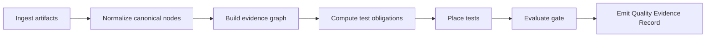

# Blueprint

R20〜R24の[統制整合契約](../spec/governance-consistency.md)では、配置先とtest実体の一致、自動引退の参照・layer・edge、timezone付き日時とnanosecond期限、非空白のIPO担当者、不明保管のDQ-16を固定する。既存承認と過去証拠は保持する。

配置・正規化・snapshotのR14〜R19契約は[gate-contract-consistency](../spec/gate-contract-consistency.md)。選択coverageとoracle適格性をplanner/Gateで共通化し、graph/plan双方を検証する。human oracleは確認待ち、不正statusと空白waiver承認者は拒否する。wire0.2を維持し、snapshotの新形式と旧形式の読み取りを区別する。

EAC-08〜10は[世代公開・実producer接続・移行の統合契約](../spec/output-publication-and-migration.md)に従う。新旧の完全世代と明示エラーを区別し、原本・承認・履歴を保持する。改修の受入とproducer対象のrelease判定は別に記録する。

## 1. Problem Statement

品質保証の材料は、仕様、実装差分、静的解析、手動テスト観点、実行結果、承認記録に分散している。
この repo は、それらを `Quality Evidence Graph` として結合し、リスクごとに最小コストで十分に反証できるテスト層を選び、再現可能な Gate 判定を返す。

## 2. Scope

In:

- `manual-bb-test-harness` と `code-to-gate` artifact の MVP ingest 契約
- `RanD` artifact の MVP ingest 契約
- requirement / risk / changed_code / finding / test_placement / gate をつなぐ canonical 型
- `go / conditional_go / no_go / disqualified` の Gate 契約
- `Quality Evidence Record` の JSON / Markdown 出力契約
- GraphML / SARIF export の型上の拡張点
- `workflow-cookbook` の Birdseye / Capsule / Task Seed 型を実装準備に流用する契約
- IPO レベル運用に向けた `ipo_controlled` profile、統制 mapping、waiver governance、監査用 evidence package の契約
- CI で不足証跡を累積表示する `report`、`doctor`、`explain`、schema/enum drift check、snapshot、GitHub Action の運用契約

Out:

- Playwright、Jest などテスト実行フレームワーク本体
- 外部 SaaS の本番設定
- 組織固有の承認フロー正本化
- LLM provider の必須化
- `workflow-cookbook` 自体の gate / governance engine 化
- `memx` / memory store 連携

## 3. Constraints / Assumptions

- local-first を既定にする。
- 必須接続先は `RanD`、`code-to-gate`、`manual-bb-test-harness` の 3 つに限定する。
- `workflow-cookbook` は adapter 入力ではなく、Birdseye / Capsule / Task Seed の文書構造型を再利用する。
- 同一 input / policy / revision では stable ID と Gate 判定が再現される。
- `sourceRefs`, `assumptions`, `confidence` を落とした Gate 判定は失格対象にする。
- schema drift は adapter contract test と golden fixture で検出する。
- manual layer は first-class な配置層として扱う。
- CI report は最初の失敗で停止せず、artifact / Step Summary / exit code output を残してから最終判定で job を失敗させる。

## 4. I/O Contract

Input:

- `manual-bb-test-harness`: `feature_spec`, `risk_register`, `manual_case_set`, `gate_decision`, `execution_evidence`
- `code-to-gate`: `normalized-repo-graph`, `diff-analysis`, `findings`, `risk-register`, `test-seeds`, `release-readiness`, `audit`
- `RanD`: `requirements_packet`, `requirements_audit_packet`
- support refs: `workflow-cookbook` Birdseye index, Birdseye capsule, Task Seed template
- optional evidence: JUnit, Coverage, SARIF, git diff

Output:

- `qeg.bundle.json`
- `test-placement-plan.json`
- `gate-verdict.json`
- `quality-evidence-record.json`

## 5. Requirements Baseline

要件定義の正本は `docs/requirements.md` とする。

追加EAC要求の対象・時点・実行資格は [証跡共通受入基準](../spec/evidence-acceptance-standard.md) で定義する。[通常実行の実装契約](../spec/execution-qualification.md)は、build原本検証→対象・identity・時計の資格判定→最新run採用→実測連続成功数の会計を行う。API/CLI/recordで同じ採用結果を共有する。[実装受入](evidence-acceptance-status.md)は単位ごとに管理する。

特に次を固定する。

- `upstream_artifacts` の必須adapterは `RanD`、`code-to-gate`、`manual-bb-test-harness`。`native_graph` はpolicyで必須artifactと評価範囲を明示する。
- `workflow-cookbook` は Birdseye / Capsule / Task Seed の補助参照に限定する。
- `memx` / memory store / journal / archive 連携は対象外。
- `disqualified` は `no_go` と別物として扱う。
- `sourceRefs`, `assumptions`, `confidence` のない Gate reason は失格対象。
- IPO レベルでは `conditional_go` を CI success として扱わず、waiver / approval / retention / evidence immutability の統制を要求する。
- QEG report の非 0 exit は GitHub Actions shell step の即時 failure ではなく、`qeg-report-action` の `exit_code` output と final verdict step で扱う。

## 6. Minimal Flow

## 7. Current State

- schema validation、Gate evaluator、record / report / snapshot、resilience evidence normalizer、3 producerのraw adapter、graph builder、7層のplacement生成、成果物一式の生成を実装した。今回の受入証拠は改修台帳に記録し、以前の一括完成表記を流用しない。
- controlled governance profile、DQ-01〜DQ-21、Reliability / Resilience blocker、waiver、artifact verification、evidence normalizer は実装済みである。
- fixture、public TypeScript contract、package smoke、Node 20 / 24 CI を release candidate の自動受入境界とする。
- 現行EAC改修の状態・判定・非対象範囲は `docs/project/evidence-acceptance-status.md`、R01〜R06の受入履歴は `docs/project/remediation-2026-09-10.md` を正本とする。過去の配布受入は `docs/release/acceptance-2026-07-20-v0.3.1.md` に保持する。

## 8. Remaining Product Decisions

- 外部consumerでの実導入結果を蓄積する。ただし隔離consumer smokeを実clusterのresilience承認へ昇格しない。
- 実cluster、実fault injection、Lakda real acceptanceは別の受入Gateで扱う。
- tag、publish、release、major/minor version更新は本体完成判定とは分離し、release ownerが別途決定する。
