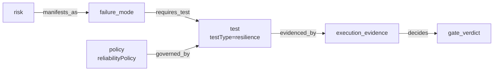
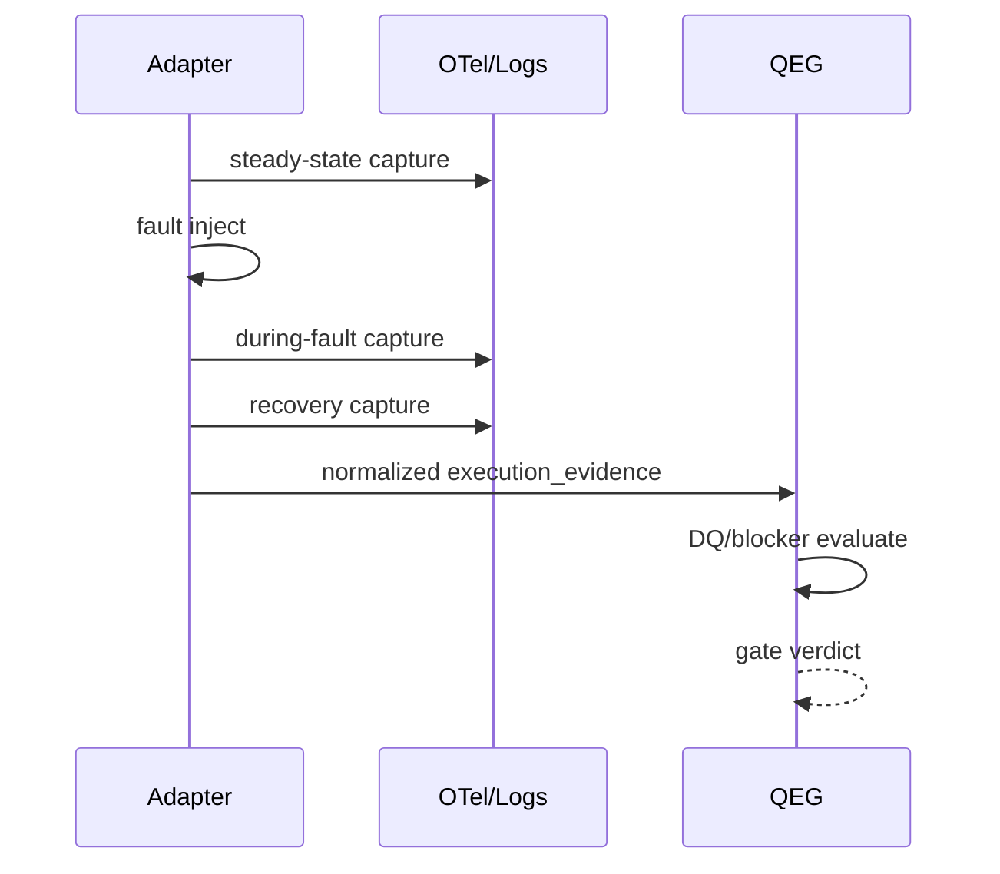

# QEG Reliability Resilience 拡張要件定義

## エグゼクティブサマリー

QEG は現状、要求・リスク・テスト・実行証跡・Gate 判定を単一グラフで扱う「統制レイヤ」であり、テスト実行基盤そのものではありません。`test` ノードは `testExecutionMode` のみが必須、`execution_evidence` は `evidenceRefs` と `passed?` が中心、`GatePolicy` は `placementRetirementPolicy` までしか持たないため、信頼性・耐障害性の判定を厳密に扱うには schema/type/evaluator の追加が必要です。ノードは `additionalProperties: true` なので後方互換的に拡張しやすい一方、`gate-policy.schema.json` は `additionalProperties: false` のため `reliabilityPolicy` は明示追加が必要です。QEG 自身は「品質判断の統制レイヤ」であり、Lakda も最終 Gate は QEG 外部と明記しているため、本拡張でも **QEG は実験を実行せず、外部アダプタが生成した resilience evidence を検証・会計し、Go/No-Go に反映する** 方針が最も整合的です。citeturn3view2turn3view1turn3view0turn12view0turn12view1turn15view0

MVP は三点です。第一に `test.kind=test` に `testType: "resilience"` と `resilienceScenario` を追加すること。第二に `execution_evidence` に fault・steady state・recovery・signals・revision provenance を追加すること。第三に `GatePolicy` に `reliabilityPolicy` を追加し、**revision 一致、real-only、evidence 鮮度、metrics/traces/logs 必須性、recoverySeconds しきい値、duplicateSideEffects=0** を評価対象にすることです。観測信号は OpenTelemetry の traces / metrics / logs を前提にし、最小メトリクスは SRE の golden signals から latency / errors / traffic / saturation を採り、HTTP 系は `http.server.request.duration` 等の標準 semantic conventions を優先します。citeturn7view6turn17view0turn7view5turn6search0

## 機能要件

| 優先 | 要件 | 受入条件 |
|---|---|---|
| MVP | `testType: resilience` の schema/type 実装 | 既存 fixture 非破壊。新 fixture で validate/gate/record が通る。citeturn11view0turn3view1 |
| MVP | `execution_evidence` に resilience fields 追加 | `targetRevision`・`status`・`fault`・`observed`・`signalRefs` が schema 検証される。 |
| MVP | `GatePolicy.reliabilityPolicy` 追加 | policy で real-only / maxAge / requiredSignals / thresholds を制御できる。 |
| MVP | DQ / blocker 追加 | revision mismatch、mock-only、evidence stale、required signal 欠落で DQ。閾値超過は blocker。 |
| MVP | report 追加 | risk ごとの resilience coverage、pass rate、recoverySeconds を出力。 |
| 次相 | アダプタ正規化 | Lakda/Toxiproxy/Chaos Mesh/Litmus/Docker Compose/shell/CI の raw payload を正規化。 |
| 次相 | policy profile | `standard`/`strict` で reliability defaults を配布。 |
| 次相 | escaped defect 接続 | escaped_defect と resilience gap をリンクし再発防止に使う。 |

## スキーマ変更案

現行 `qeg.bundle.schema.json` は `test` に `testExecutionMode` しか要求せず、`execution_evidence` も最小です。現行 `GatePolicy` は `policyId` など必須項目と `placementRetirementPolicy` のみです。したがって以下の追補を提案します。citeturn3view1turn3view0turn12view0turn12view1

### test.node 追加

```json
{
  "testType": { "enum": ["functional", "security", "performance", "resilience"] },
  "resilienceScenario": {
    "type": "object",
    "required": ["faultModel", "steadyState", "blastRadius", "abortConditions"],
    "additionalProperties": false,
    "properties": {
      "faultModel": {
        "enum": [
          "dependency_timeout","dependency_http_error","network_latency",
          "packet_loss","process_crash","container_restart","pod_kill",
          "duplicate_event","out_of_order_event","resource_pressure","custom"
        ]
      },
      "steadyState": {
        "type": "object",
        "required": ["slos", "requiredMetrics", "requiredTraces", "requiredLogs"],
        "additionalProperties": false,
        "properties": {
          "slos": {
            "type": "array",
            "items": {
              "type": "object",
              "required": ["name","sli","targetType","target","unit"],
              "properties": {
                "name": {"type":"string"},
                "sli": {"type":"string"},
                "targetType": {"enum":["max","min","range"]},
                "target": {"type":"number"},
                "unit": {"type":"string"}
              }
            }
          },
          "requiredMetrics": {"type":"array","items":{"type":"string"},"minItems":1},
          "requiredTraces": {"type":"boolean"},
          "requiredLogs": {"type":"boolean"}
        }
      },
      "blastRadius": {
        "type":"object",
        "required":["environment","maxTargets","allowedTargets","maxDurationSeconds"],
        "properties":{
          "environment":{"enum":["local","ci","staging","preprod","production"]},
          "maxTargets":{"type":"integer","minimum":1},
          "allowedTargets":{"type":"array","items":{"type":"string"}},
          "maxDurationSeconds":{"type":"integer","minimum":1}
        }
      },
      "abortConditions": {
        "type":"array",
        "minItems":1,
        "items":{
          "type":"object",
          "required":["condition","source"],
          "properties":{
            "condition":{"type":"string"},
            "source":{"enum":["metric","trace","log","probe","manual"]},
            "threshold":{"type":"number"},
            "unit":{"type":"string"}
          }
        }
      }
    }
  }
}
```

### execution_evidence 追加

```json
{
  "adapter": {"type":"string"},
  "testId": {"$ref":"shared-defs.schema.json#/$defs/stableId"},
  "targetRevision": {"type":"string","minLength":1},
  "environmentId": {"type":"string"},
  "startedAt": {"$ref":"shared-defs.schema.json#/$defs/isoDateTime"},
  "endedAt": {"$ref":"shared-defs.schema.json#/$defs/isoDateTime"},
  "status": {"enum":["pass","fail","aborted","error","timeout","skipped"]},
  "steadyStateConfirmed": {"type":"boolean"},
  "recovered": {"type":"boolean"},
  "recoverySeconds": {"type":"number","minimum":0},
  "fault": {
    "type":"object",
    "required":["type","parameters"],
    "properties":{
      "type":{"type":"string"},
      "parameters":{"type":"object","additionalProperties":true}
    }
  },
  "observed": {
    "type":"object",
    "required":["requestCount","errorRate","latencyP95Ms","duplicateSideEffects","dataInconsistencies"],
    "properties":{
      "requestCount":{"type":"integer","minimum":0},
      "errorRate":{"type":"number","minimum":0,"maximum":1},
      "latencyP95Ms":{"type":"number","minimum":0},
      "saturationPct":{"type":"number","minimum":0,"maximum":100},
      "duplicateSideEffects":{"type":"integer","minimum":0},
      "dataInconsistencies":{"type":"integer","minimum":0},
      "traceCount":{"type":"integer","minimum":0},
      "logCount":{"type":"integer","minimum":0}
    }
  },
  "signalRefs": {
    "type":"object",
    "required":["metrics","traces","logs"],
    "properties":{
      "metrics":{"type":"array","items":{"$ref":"shared-defs.schema.json#/$defs/evidenceRef"}},
      "traces":{"type":"array","items":{"$ref":"shared-defs.schema.json#/$defs/evidenceRef"}},
      "logs":{"type":"array","items":{"$ref":"shared-defs.schema.json#/$defs/evidenceRef"}}
    }
  }
}
```

### gate policy 追加

```json
{
  "reliabilityPolicy": {
    "type":"object",
    "required":[
      "enabled","requiredForSeverities","allowedExecutionModes","maxEvidenceAgeHours",
      "requireRevisionMatch","requireSteadyStateBeforeFault","requireRecoveryObservation",
      "requiredSignals","thresholds","safety"
    ],
    "additionalProperties": false,
    "properties":{
      "enabled":{"type":"boolean"},
      "requiredForSeverities":{"type":"array","items":{"$ref":"shared-defs.schema.json#/$defs/severity"}},
      "allowedExecutionModes":{"type":"array","items":{"enum":["real","mock"]}},
      "maxEvidenceAgeHours":{"type":"integer","minimum":1},
      "requireRevisionMatch":{"type":"boolean"},
      "requireSteadyStateBeforeFault":{"type":"boolean"},
      "requireRecoveryObservation":{"type":"boolean"},
      "requiredSignals":{
        "type":"object",
        "required":["metrics","traces","logs"],
        "properties":{"metrics":{"type":"boolean"},"traces":{"type":"boolean"},"logs":{"type":"boolean"}}
      },
      "thresholds":{
        "type":"object",
        "required":["maxErrorRate","maxLatencyP95Ms","maxRecoverySeconds","maxDuplicateSideEffects","maxDataInconsistencies"],
        "properties":{
          "maxErrorRate":{"type":"number","minimum":0,"maximum":1},
          "maxLatencyP95Ms":{"type":"number","minimum":0},
          "maxRecoverySeconds":{"type":"number","minimum":0},
          "maxDuplicateSideEffects":{"type":"integer","minimum":0},
          "maxDataInconsistencies":{"type":"integer","minimum":0}
        }
      },
      "safety":{
        "type":"object",
        "required":["allowedEnvironments","forbidProduction","maxBlastRadiusTargets","maxFaultDurationSeconds"],
        "properties":{
          "allowedEnvironments":{"type":"array","items":{"enum":["local","ci","staging","preprod","production"]}},
          "forbidProduction":{"type":"boolean"},
          "maxBlastRadiusTargets":{"type":"integer","minimum":1},
          "maxFaultDurationSeconds":{"type":"integer","minimum":1}
        }
      }
    }
  }
}
```

## アダプタ契約

Lakda は状態遷移・replay・停止条件・証跡生成を担い、最終 Gate は QEG 外部です。Toxiproxy は CI/開発環境向けの deterministic な network tampering を提供し、HTTP API と Prometheus `/metrics` を持ちます。Chaos Mesh は CRD/Workflow/RBAC/StatusCheck/abort を備え、LitmusChaos は declarative experiment と probes / verdict を備えます。Docker Compose は `healthcheck` を持ち、CI では GitHub Actions artifacts を保管できます。citeturn15view0turn8view2turn8view3turn9view0turn9view2turn10view0turn7view3turn6search13turn7view7turn7view8

| Adapter | 入力 | 出力 | MVP |
|---|---|---|---|
| Lakda | replay/scenario/fault hook | HATE/QEGへ渡す normalized evidence | 高 |
| Toxiproxy | proxy + toxic 定義 | REST/metrics 結果 | 高 |
| shell scripts | 任意 script | exit code + JSON | 高 |
| CI | artifact URL/path | raw artifact manifest | 高 |
| Docker Compose | service/action/healthcheck | container event + logs | 中 |
| Chaos Mesh | Workflow/CRD/status | workflow status + artifacts | 中 |
| LitmusChaos | ChaosEngine/ChaosResult | verdict + probe stats | 中 |

**Normalized adapter output contract**

```json
{
  "schemaVersion": "0.1",
  "adapter": "toxiproxy",
  "experimentId": "rel-001",
  "targetRevision": "abcdef1",
  "status": "pass",
  "startedAt": "2026-07-19T01:00:00Z",
  "endedAt": "2026-07-19T01:01:10Z",
  "steadyStateConfirmed": true,
  "fault": { "type": "dependency_timeout", "parameters": { "proxy": "payment", "timeoutMs": 30000 } },
  "observed": { "errorRate": 0.004, "latencyP95Ms": 820, "duplicateSideEffects": 0, "dataInconsistencies": 0 },
  "artifacts": [{ "id":"art:metrics", "path":"artifacts/metrics.json", "kind":"execution_evidence", "adapter":"toxiproxy", "revision":"abcdef1" }]
}
```

**Toxiproxy raw payload sample**

```json
{ "name":"payment", "type":"timeout", "stream":"downstream", "toxicity":1.0, "attributes":{"timeout":30000} }
```

**Chaos Mesh raw payload sample**

```yaml
apiVersion: chaos-mesh.org/v1alpha1
kind: Workflow
spec:
  entry: main
  templates:
    - name: main
      templateType: Serial
      children: [status-check, payment-delay]
    - name: status-check
      templateType: StatusCheck
      abortWithStatusCheck: true
```

## Provenance DQ 安全ルール

推奨 DQ は `DQ-18` 以降として追加します。`DQ-18 revision_mismatch`、`DQ-19 mock_not_allowed`、`DQ-20 evidence_stale`、`DQ-21 required_signals_missing`、`DQ-22 no_steady_state_confirmation`、`DQ-23 missing_abort_or_recovery_record` です。`shared-defs` と `primitives.ts` の `DisqualificationCode` enum を拡張してください。現行 QEG でも DQ は最優先で waiver では消せません。citeturn3view2turn4view0turn13view0

観測必須性は policy で制御しますが、既定値は **metrics=true, traces=true, logs=true** を推奨します。OpenTelemetry は signals として traces / metrics / logs を提供し、HTTP では `http.server.request.duration` が required metric です。SRE 観測は latency / traffic / errors / saturation を最小集合にします。citeturn7view6turn17view0turn7view5

安全規則は Principles of Chaos の steady state hypothesis と blast radius 最小化に従い、QEG policy には `forbidProduction`, `allowedEnvironments`, `maxBlastRadiusTargets`, `maxFaultDurationSeconds` を必須化します。Chaos Mesh 連携時は `StatusCheck` と `abortWithStatusCheck` を必須推奨にします。citeturn7view4turn10view0turn10view2

## サンプル

```yaml
id: qeg:test:payment-timeout
kind: test
title: Payment timeout resilience
layer: integration
testType: resilience
testExecutionMode: real
existing: true
resilienceScenario:
  faultModel: dependency_timeout
  steadyState:
    slos:
      - { name: checkout_error_rate, sli: error_rate, targetType: max, target: 0.01, unit: ratio }
    requiredMetrics: [http.server.request.duration, app.duplicate_side_effects]
    requiredTraces: true
    requiredLogs: true
  blastRadius:
    environment: staging
    maxTargets: 1
    allowedTargets: [payment-adapter]
    maxDurationSeconds: 60
  abortConditions:
    - { condition: "duplicateSideEffects>0", source: metric }
```

```json
{
  "id":"qeg:evd:rel-001",
  "kind":"execution_evidence",
  "title":"payment timeout experiment result",
  "testId":"qeg:test:payment-timeout",
  "adapter":"toxiproxy",
  "targetRevision":"abcdef1",
  "status":"pass",
  "steadyStateConfirmed":true,
  "recovered":true,
  "recoverySeconds":42,
  "fault":{"type":"dependency_timeout","parameters":{"timeoutMs":30000}},
  "observed":{"requestCount":1200,"errorRate":0.004,"latencyP95Ms":820,"duplicateSideEffects":0,"dataInconsistencies":0,"traceCount":214,"logCount":51},
  "signalRefs":{"metrics":[],"traces":[],"logs":[]}
}
```





## 実装計画 メトリクス 責務

| Task | 変更箇所 | Size |
|---|---|---|
| schema/type 追加 | `schemas/*.json`, `src/types/*.ts` | M |
| evaluator/DQ | `src/evaluator/reliability.*` | M |
| adapter normalization | `src/adapters/reliability/*` | M-L |
| report/explain | `src/report/*`, `src/cli.*` | S-M |
| fixtures/tests/docs | `fixtures/*`, `tests/*`, `docs/spec/*` | M |

推奨 repo 変更は `schemas/qeg.bundle.schema.json`, `schemas/gate-policy.schema.json`, `schemas/shared-defs.schema.json`, `src/types/primitives.ts`, `src/types/graph.ts`, `src/types/gate.ts`, `docs/spec/reliability-extension.md`, `fixtures/positive-resilience-go`, `fixtures/negative-resilience-revision-mismatch`, `fixtures/negative-resilience-stale-evidence`, `tests/reliability-schema.test.mjs` です。現行 package には `validate/gate/record/report/explain/evidence/policy` が既にあるため、新コマンドは最小化し、`qeg evidence normalize --adapter <kind>` と `qeg report --section reliability` の追加で十分です。citeturn11view0

追跡メトリクスは `resiliencePassRate`, `riskCoverageByResilience`, `recoverySeconds p50/p95`, `duplicateSideEffects count`, `dataInconsistencies count`, `dqCountByRule`, `mockExcludedCount`, `evidenceAgeHours` を推奨します。ダッシュボードは外部 observability backend 前提で、QEG は JSON/Markdown を出すだけに留めるべきです。OpenTelemetry は signal 収集/export の枠組みであり、QEG も統制レイヤであって実験実行基盤ではありません。citeturn7view6turn3view2

最優先リスクは、production での過大 blast radius、PII を含む logs/traces の持ち込み、証跡 revision 不一致、mock を real と誤計上、そして QEG が experiment runner 化する責務逸脱です。**QEG must not do** は明確で、fault 注入実行、Kubernetes/Compose 操作、環境払い出し、シークレット管理、deployment/rollback 実行を持つべきではありません。Lakda や Chaos ツールは証跡 producer、QEG は validator/accountant/judge に徹するべきです。citeturn15view0turn9view0turn9view2turn8view3turn3view2

**優先ソース**: QEG 日本語 README / schemas / types citeturn3view2turn3view1turn3view0turn12view0turn12view1turn13view0、OpenTelemetry signals / HTTP semantic conventions citeturn7view6turn17view0、Google SRE golden signals citeturn7view5、Principles of Chaos citeturn7view4、Toxiproxy citeturn8view2turn8view3、Chaos Mesh citeturn9view0turn9view2turn10view0、LitmusChaos citeturn7view3turn6search13、Docker Compose healthcheck citeturn7view7、GitHub Actions artifacts citeturn7view8。